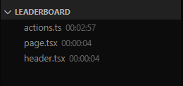

# TimeCode - Visual Studio Code Extension

TimeCode is a productivity-enhancing extension for Visual Studio Code that enables you to effortlessly track and manage your coding time.

## Features

- **Time Tracking**: Automatically records the time you spend editing each file within your workspace.

- **Leaderboard**: Displays a sidebar leaderboard of the most frequently accessed files, along with the time spent on each.

- **Real-Time Updates**: Updates the leaderboard in real time as you code.

- **Open Files Quickly**: Clicking on a leaderboard item opens the associated file in the text editor.

- **Start Tracking Immediately**: Begins tracking time as soon as VS Code starts, if files are already open.

- **User-Friendly Format**: Time spent is presented in an easily readable HH:MM:SS format.

## Usage

1. Install the extension from the Visual Studio Code Marketplace.

2. Open your workspace, and the extension will start tracking time automatically.

3. Click on a leaderboard item to quickly open the associated file in the editor.

4. Gain insights into your coding habits and boost your productivity.

## Requirements

- Visual Studio Code

## Installation

1. Open Visual Studio Code.

2. Go to the Extensions view by clicking on the square icon in the sidebar.

3. Search for "TimeCode."

4. Click the Install button.

## Extension Settings

- No additional settings are required. The extension works out of the box.

## Known Issues

- None at the moment.

## Contributing

Contributions are welcome! If you have any ideas, improvements, or bug fixes, please submit a pull request.

## License

This extension is licensed under the [MIT License](LICENSE).

---

Happy coding!
